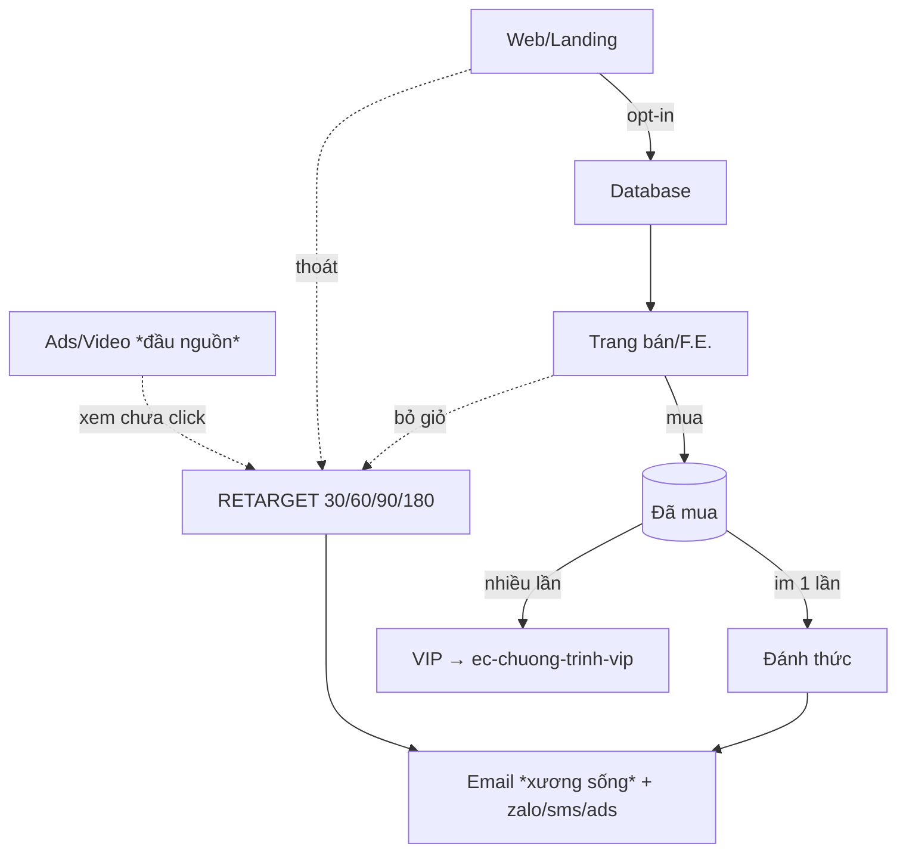

# KHUNG BẢN ĐỒ ĐIỂM CHẠM + CHƯƠNG TRÌNH REMARKETING (mắt xích 13 Khởi Nghiệp)

Copy khung này khi xuất ở bước cuối. Lưu `tang-truong/YYYY-MM-DD-<slug>-remarketing.md` ở gốc vault.
Thay mọi `[...]` bằng nội dung thật. Mọi số dán nhãn nguồn/ước lượng. Điểm chạm/kênh `[đề xuất]` phân biệt với `[đang chạy]`. Điểm chạm khách-rớt-mà-chưa-ai-chạm ghi "TRỐNG". Giữ wikilink về xương + concept Brain.

---

```markdown
---
type: analysis
tags: [remarketing, marketing-vao, diem-cham, touchpoint, khoi-nghiep, retarget, course/ec]
created: YYYY-MM-DD
updated: YYYY-MM-DD
status: draft            # draft | hypothesis | validated
sources: ["[[M9.6 - Marketing vào (database)]]", "[[Customer journey - funnel bẫy chuột + retarget 30-60-90-180]]", "[[Hệ thống phễu marketing Eagle Camp]]"]

# ── HỢP ĐỒNG BÀN GIAO ──
produces:
  touchpoint_map: "[N điểm chạm — M điểm TRỐNG, 1 dòng]"
  segments:
    - ten: "[nhóm 1 — vd VIP/mua nhiều lần]"
      quy_mo: "[số thật / [?]]"
    - ten: "[nhóm 2 — mua một lần]"
      quy_mo: "[..]"
    - ten: "[nhóm 3 — chưa mua, đã để lại liên hệ]"
      quy_mo: "[..]"
  programs:
    - diem_cham: "[điểm chạm A]"
      nhom: "[nhóm]"
      muc_tieu: "[đánh thức / cứu giỏ / bán thêm]"
      kenh: "[email + ...]"
      lich_retarget: "[30/60/90/180 hoặc tuỳ biến]"
  assets_to_build:
    - loai: "Chuỗi email [.. ]"
      skill: "[skill content/email]"
      brief: "[1 dòng]"
    - loai: "Sale page [đánh thức / ưu đãi]"
      skill: "ec-trang-ban-hang"
      brief: "[1 dòng]"
    - loai: "Tệp retarget ads"
      skill: "marketing/ads (đầu nguồn)"
      brief: "[1 dòng]"
  depends_on:
    - "ec-ho-so-khach-hang — #1 persona (nhóm khách, pains/gains, kênh)"
    - "ec-xay-pheu — mắt xích 9 phễu (các chặng khách rớt = điểm chạm)"
---

# Bản đồ điểm chạm + Remarketing — [Ngách/Sản phẩm] — [YYYY-MM-DD]

## Đề bài
- **Sản phẩm + giá:** [...]  · **Khách + đau cốt lõi:** [...]
- **Database đang nắm:** [tổng số liên hệ — số thật / [?]] · ở đâu: [Excel/CRM/danh bạ/inbox/list email/pixel]
- **Hành trình mua hiện tại:** [...]  · **Kênh đang chạy:** [...]  · **Mục tiêu remarketing:** [...]

## 1. Bản đồ điểm chạm
| Giai đoạn | Điểm chạm | Nhóm database | Kênh chạm lại | Trạng thái |
|---|---|---|---|---|
| Trước mua | [...] | [...] | [...] | [đang chạy]/[đề xuất]/**TRỐNG** |
| Trong mua | [...] | [...] | [...] | |
| Sau mua | [...] | [...] | [...] | |


*(thay node theo hành trình thật; node rớt chưa có chương trình = TRỐNG)*

*Kiểm: điểm rớt nào rò rỉ tiền nhiều nhất? điểm nào TRỐNG?*

## 2. Segment database — 5 câu hỏi marketing-vào (M9.6)
| Nhóm | (1) Phân nhóm | (2) Chào gì | (3) Tần suất | (4) USP | (5) Kênh |
|---|---|---|---|---|---|
| [nhóm 1] | [...] | [...] | [...] | [...] | [...] |
| [nhóm 2] | [...] | [...] | [...] | [...] | [...] |
| [nhóm 3] | [...] | [...] | [...] | [...] | [...] |

*Email là trục ("xương sống"). Hạ tầng DKIM/tên miền → trỏ IPS.*

## 3. Chương trình remarketing mỗi điểm chạm
### Chương trình [A] — [tên điểm chạm]
- **Nhóm đích:** [..] (quy mô [số/[?]]) · **Mục tiêu:** [..] · **Đòn bẩy:** [2 chuyển đổi / 4 tần suất]
- **Lịch retarget:** 30 [..] → 60 [..] → 90 [..] → 180 [..]
- **Kiểu chuỗi nuôi:** [phim dài tập / đời thường] — cho > xin
- **Kênh + tần suất:** [email trục + ...]
- **USP lần này:** [..]
- **Chỉ số mục tiêu:** [open/reply/CVR — (ước lượng — cách tính)]

### Chương trình [B] — ...
*(lặp cho mỗi điểm chạm đã chốt ở mục 1)*

## 4. Asset cần sản xuất (bàn giao)
| Asset | Điểm chạm | Skill nên dùng | Brief |
|---|---|---|---|
| [...] | [...] | [...] | [...] |

## 5. Phase liên quan (trỏ, không làm ở đây)
- Continuity/sản phẩm định kỳ → `ec-san-pham-lien-tuc` · VIP/loyalty → `ec-chuong-trinh-vip` · LVC hub → `ec-tang-truong-lvc`
- Kéo khách MỚI: JV → `ec-lien-doanh` · Referral → `ec-gioi-thieu-khach`
- Hút traffic lạnh đầu nguồn + hạ tầng email kỹ thuật → marketing / IPS

## Self-verify (cổng chống bịa)
- [x] Quy mô database + số mỗi nhóm thật/[?] · [x] Mọi CVR/open/reply/CPM có nhãn · [x] [đề xuất] phân biệt [đang chạy] · [x] Điểm chạm TRỐNG lộ · [x] Benchmark nước ngoài dán nhãn (không cam kết) · [x] Không chuỗi nào spam "mua đi" (cho > xin)
```
