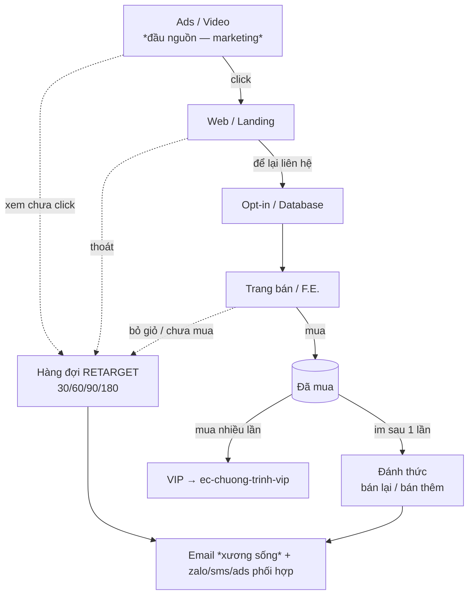

# Bản đồ điểm chạm (B1) — touchpoint map trên hành trình khách

Trước khi thiết kế chương trình chạm lại, phải biết **khách chạm thương hiệu ở đâu** và quan trọng hơn — **khách RỚT ở đâu**. Mỗi điểm rớt mà không ai chạm lại = một chỗ rò rỉ tiền. Nguồn: M9.6 (marketing vào) + [[Customer journey - funnel bẫy chuột + retarget 30-60-90-180]] (*"Follow-up nằm ở TOÀN BỘ hệ thống, không phải cuối phễu."*). Bài giảng đầy đủ: `bai-giang-m9-6.md`.

> **Nguyên lý "bẫy chuột" — mỗi node 2 nhánh.** PTL vẽ luồng khách đầy đủ (IPS 11), tại MỖI node khách rẽ: *"một là làm"* (đi tiếp) / *"hai là không làm"* (rơi ra → hàng đợi retarget). Mỗi đường link là một cái bẫy; "thoát" thì có bẫy sau chờ ở 30/60/90/180. Vẽ bản đồ điểm chạm = liệt mọi node + đánh dấu nhánh "không làm" nào đang TRỐNG (không có bẫy retarget chờ).

> **Ranh giới**: hút traffic lạnh đổ vào đầu phễu là **đầu nguồn — việc marketing**, skill này chỉ TRỎ. Bản đồ điểm chạm ở đây tập trung vào **chạm LẠI người đã từng tiếp xúc / đã trong database**.

## Điểm chạm là gì

Một **điểm chạm (touchpoint)** = một thời điểm/nơi khách tiếp xúc thương hiệu trên hành trình. Với remarketing, ta quan tâm 2 loại:
- **Điểm tiếp xúc** — khách đã ghé (xem ads, vào web, để lại liên hệ, từng mua).
- **Điểm rớt** — khách dừng lại / bỏ đi / im lặng (thoát web, bỏ giỏ, hỏi giá rồi im, mua một lần rồi mất hút). Đây là mục tiêu chính của chạm lại.

## Khung 3 giai đoạn — trước / trong / sau mua

| Giai đoạn | Điểm chạm (đã tiếp xúc / đã rớt) | Nhóm database tương ứng | Kênh chạm lại khả dĩ |
|---|---|---|---|
| **Trước mua** | xem ads/video chưa click · vào web/landing rồi thoát · để lại liên hệ (opt-in) chưa mua · inbox/zalo hỏi giá rồi im · đăng ký webinar không dự | "chưa mua, đã để lại dấu" | retarget ads · email nuôi · zalo/messenger · sms |
| **Trong mua** | thêm giỏ chưa thanh toán · điền form chưa hoàn tất · vào trang bán rồi rớt · gọi tư vấn xong chưa chốt | "đang cân nhắc, sắp rớt" | retarget ads · email cứu giỏ · gọi điện · zalo |
| **Sau mua** | mua một lần rồi im · mua nhiều lần (VIP) · "ngủ đông" cả năm · mua sản phẩm A (chưa lên A→B) · hết hạn gói/định kỳ | "đã mua — bán lại / bán thêm / đánh thức" | email bán-thêm/bán-lại · zalo chăm sóc · sms ưu đãi · gọi điện VIP |

→ Mỗi ô là một **ứng viên điểm chạm**. Không phải dự án nào cũng có đủ — liệt cái có thật, đánh dấu cái TRỐNG.

## Map chặng-khách-rớt của phễu (mắt xích 9) thành điểm chạm

Nếu pipeline có bản vẽ phễu (`funnel/...` từ `ec-xay-pheu`), **mỗi chặng khách rơi trong phễu = một điểm chạm**:

| Chặng phễu | Điểm rớt → điểm chạm remarketing |
|---|---|
| Opt-in (squeeze) | vào squeeze không để lại liên hệ → retarget ads quay lại; để lại rồi → vào chuỗi nuôi |
| F.E. (quà tặng điên rồ) | từ chối F.E. → downsell + nuôi dưỡng quay lại F.E. |
| Upsell / Bundle | từ chối upsell → nhắc lại sau, đổi góc |
| Bậc lõi / cao cấp | xem trang bán chưa mua → email + retarget; mua rồi im → bán-thêm sau mua |

→ Đây chính là *"follow-up rải khắp hệ thống"* — không đợi đến cuối phễu mới chạm lại.

## Đánh dấu trạng thái mỗi điểm chạm

- `[đang chạy]` — người làm đã có chương trình chạm lại điểm này (dữ liệu thật).
- `[đề xuất]` — skill nghĩ thêm, chưa có.
- **"TRỐNG"** — khách rớt ở đây mà KHÔNG ai chạm lại. Ghi rõ, không che → đây là chỗ rò rỉ tiền cần ưu tiên.

## Sơ đồ mermaid hành trình (mẫu để dán vào bản đồ)

Sửa node theo hành trình thật. Nhánh "rớt" trỏ vào hàng đợi remarketing:

> Mọi node "rớt" phải nối về một chương trình chạm lại. Node chưa có chương trình = đánh dấu **TRỐNG**.

## Sản phẩm của B1

1. **Bảng điểm chạm** đầy đủ (trước/trong/sau mua) — mỗi dòng: điểm chạm · nhóm database · kênh khả dĩ · trạng thái (`[đang chạy]`/`[đề xuất]`/TRỐNG).
2. **Sơ đồ mermaid** hành trình + nhánh rớt.
3. Chốt **các điểm chạm sẽ làm chương trình** ở B3 (ưu tiên điểm TRỐNG rò rỉ tiền nhiều nhất).
