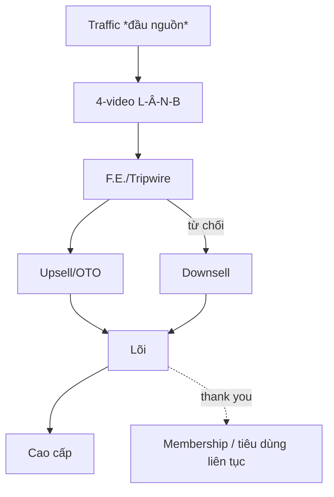

# KHUNG BẢN VẼ PHỄU (mắt xích 9 Khởi Nghiệp)

Copy khung này khi xuất ở Bước 5. Lưu `funnel/YYYY-MM-DD-<ngách-slug>.md` ở gốc vault.
Thay mọi `[...]` bằng nội dung thật. Mọi số dán nhãn nguồn/ước lượng. Bậc/thành phần `[đề xuất]` phân biệt với cái đã có. Giữ wikilink về `wiki/concepts/funnel/`.

---

```markdown
---
type: analysis
tags: [xay-pheu, funnel, khoi-nghiep, thang-gia-tri, value-ladder]
created: YYYY-MM-DD
updated: YYYY-MM-DD
status: draft            # draft | hypothesis | validated
sources: ["[[Phễu sản phẩm]]", "[[Hệ thống phễu marketing Eagle Camp]]", "[[_index]]"]

# ── HỢP ĐỒNG BÀN GIAO ──
produces:
  value_ladder: "[5 bậc + bậc trống, 1 dòng]"
  core_value: "[lõi giá trị xuyên thang]"
  funnel_type: "[lead | tripwire | webinar | 4-video liên hoàn] (+ phụ)"
  money_model: "LVC [..] · CAC trần [..] · break-even [có/không] · hoàn vốn [..] ngày (ước lượng)"
  assets_to_build:
    - loai: "Sale page bậc lõi"
      skill: "ec-trang-ban-hang"
      brief: "[1 dòng]"
    - loai: "Trang squeeze F.E."
      skill: "[skill content/landing]"
      brief: "[1 dòng]"
    - loai: "Chuỗi email nuôi dưỡng"
      skill: "[skill content/email]"
      brief: "[1 dòng]"
  next_phase:
    - "ec-san-pham-lien-tuc/ec-chuong-trinh-vip/ec-remarketing — thiết kế Continuity/VIP/Marketing-vào cho bậc trên thang"
    - "ec-lien-doanh/ec-gioi-thieu-khach — JV + Referral đổ thêm khách vào chân thang"
---

# Bản vẽ phễu — [Ngách/Sản phẩm] — [YYYY-MM-DD]

## Đề bài
- **Sản phẩm + giá:** [...]  · **Khách + đau cốt lõi:** [...]
- **Lõi giá trị (sợi chỉ đỏ):** [...]
- **Mục tiêu phễu:** [...]  · **Kênh traffic (đầu nguồn):** [...]  · **Vốn:** [...]

## 1. Thang giá trị
| Bậc | Vai trò | Sản phẩm | Giá | Ghi chú |
|---|---|---|---|---|
| 1 Miễn phí | mồi mở cửa | [...] | 0đ | |
| 2 Vào cửa | giao dịch đầu | [...] | [..] | |
| 3 Lõi | sản phẩm chính | [...] | [..] | |
| 4 Cao cấp | lợi nhuận chính | [TRỐNG?] | [..] | |
| 5 Đáy phễu | biên cao nhất | [TRỐNG?] | [..] | |

*Kiểm: mọi bậc cùng 1 lõi? bậc trống đã lộ? Continuity nằm bậc nào (→ ec-san-pham-lien-tuc/ec-chuong-trinh-vip/ec-remarketing)?*

## 2. Cụm chuyển đổi
- **F.E. (9.1):** offer · giá · loại cửa (lead magnet free / tripwire giá thấp) · vì sao không-thể-từ-chối (Value Equation) · CTA · Hook-Story-Offer. *(Kiểm: đo bằng giao dịch đầu không phải lãi; có ≥1 upsell SẴN SÀNG chưa?)*
- **Upsell/Downsell/Add-on (9.2):** sequence 4 nhịp (yes FE → upsell → downsell → add-on) + giá mỗi bước + **câu "lựa chọn có-có"** mỗi bước. *(Kiểm: upsell liền ngành FE? downsell là đổi món chứ không giảm giá? add-on có order-bump?)*
- **Bundle (9.3):** combo + bảng **chồng giá trị** (món | giá trị quy đổi → tổng lẻ → giá combo rẻ hơn ≥15-20%) + đặt tên combo. *(Kiểm: các món bổ trợ — "ai dùng, dùng vào việc gì"?)*

## 3. Sơ đồ phễu liên hoàn
*Loại phễu chốt: [...]*

**Đường ống 4-video dẫn vào (nếu dùng):** V1 Vấn đề (Lạnh, KHÔNG bán) → V2 Giải pháp thông thường (Ấm) → V3 Giải pháp của tôi (Nóng, USP) → V4 Bán (offer + scarcity).


*(thay bằng sơ đồ thật theo thang; thử nối đan chéo up/down = mê hồn trận)*

**Giải phẫu trang cần xếp đúng chuỗi:** squeeze → sale/VSL → order (+ bump) → OTO → downsell → thank you → membership.

| Chặng | Mục tiêu | Asset | Thông điệp | CTA | Chỉ số (ước lượng) |
|---|---|---|---|---|---|
| ... | ... | ... | ... | ... | ... |

## 4. Money Model
| Chỉ số | Giá trị | Nguồn/nhãn |
|---|---|---|
| LVC | [..] | phóng chiếu chuyển bậc |
| CAC trần | [..] | = LVC × biên |
| Break-even front-end? | [có/không] | |
| Lãi gộp 30 ngày / khách | [..] | F.E. + upsell + continuity − CAC |
| Hệ số tái đầu tư (khách sinh khách) | [..] | lãi gộp 30 ngày ÷ CAC (≥1 = tự nuôi) |
| Hoàn vốn 1 khách | [..] ngày | vòng vốn 30 ngày |

*Cảnh báo:* [biên mỏng / thiếu bậc trên / hoàn vốn xa — nếu có → kéo thêm Continuity hoặc Upsell]

## 4.5 Kiểm 4 cổng chất lượng phễu (BẮT BUỘC — điền trước khi xuất)

Mỗi cổng ghi **Đạt / Trượt** + 1 dòng lý do; cổng Trượt phải sửa rồi mới xuất (chi tiết tiêu chí ở `references/`). Số dùng để kiểm vẫn dán nhãn ước lượng.

| # | Cổng | Kết | Lý do (1 dòng) |
|---|---|---|---|
| 1 | Thang giá trị (≥3 bậc · 1 lõi · bậc trống lộ · mỗi bậc lọc+cầu) | [Đạt/Trượt] | [...] |
| 2 | F.E. "cho đi điên rồ" thật (giá trị cảm nhận ≫ giá · "không lấy là ngu") | [Đạt/Trượt] | [...] |
| 3 | Tripwire đủ mạnh kéo khách RỜI đối thủ (vượt rào giao dịch đầu · không cụt) | [Đạt/Trượt] | [...] |
| 4 | Tài chính đủ mục tiêu (bóc ngược lõi/cao cấp → số/ngày khả thi, số dán nhãn) | [Đạt/Trượt] | [...] |

## 5. Asset cần sản xuất (bàn giao)
- [ ] [loại] → `[skill]` — [brief]
- [ ] ...

## 6. Phase sau (trỏ, không làm ở đây)
- Continuity/VIP/Marketing-vào → `ec-san-pham-lien-tuc/ec-chuong-trinh-vip/ec-remarketing`
- JV/Referral → `ec-lien-doanh/ec-gioi-thieu-khach`

## Self-verify (cổng chống bịa + 4 cổng kiểm chất lượng)
- [x] Giá bậc truy được/[?] · [x] Số money model có nhãn · [x] [đề xuất] phân biệt · [x] Bậc trống lộ · [x] Lõi xuyên suốt
- [x] **4 cổng (mục 4.5) đều ĐẠT** — Cổng 1 thang · Cổng 2 F.E. điên rồ · Cổng 3 tripwire kéo khách khỏi đối thủ · Cổng 4 tài chính đủ mục tiêu (số dán nhãn ước lượng). Cổng trượt → đã sửa, không xuất khi còn trượt.
```
