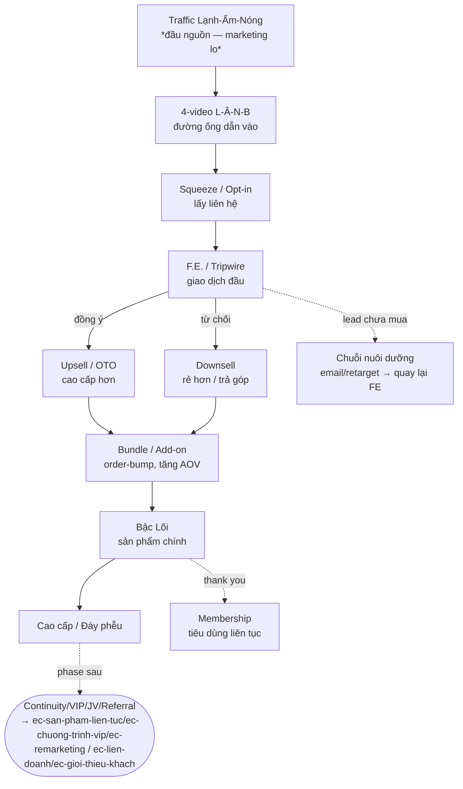

# Ráp phễu liên hoàn (9.9) — nối thành dòng chảy chạy được

Module ĐÓNG của hệ thống phễu. Sau khi có thang (B1) + cụm chuyển đổi (B2), bước này **nối tám thành phần rời (9.1–9.8) thành MỘT dây chuyền nước chảy được** — rồi mổ xẻ thành những trang dựng được thật. Nguồn: giáo án `M9.9`; concept [[Phễu liên hoàn (cascading funnel)]] · [[Tripwire]] · [[4-video funnel lạnh ấm nóng bán]] · [[Funnel hệ thống PTL]] + thư viện recipe Brunson.

> **Ranh giới:** traffic (đổ lead vào miệng phễu) là **đầu nguồn — việc của marketing/Lạnh-Ấm-Nóng**, skill này chỉ TRỎ, không thiết kế lại. Việc viết *nội dung* từng trang (offer/headline/sale copy) là khâu sản xuất riêng (→ ec-trang-ban-hang). Ráp ở đây bắt đầu từ F.E. trở đi.
>
> **Anti-fab:** phễu liên hoàn + 4-video lạnh-ấm-nóng-bán là tự đóng gói của PTL. Seven Phases + 37 loại trang của Brunson chỉ đối chiếu. Mọi con số (giá yến 2,5tr/1,1tr, link 4,95 đô, tỉ lệ trôi giữa tầng) là **minh hoạ — không cam kết**.

## Vào bài — tám mảnh ghép vẫn chưa phải một cái phễu

Tám buổi 9.1–9.8 cho **tám mảnh ghép**: F.E. quà tặng điên rồ, upsell/downsell, đóng gói, tiêu dùng liên tục, VIP, marketing-in, liên doanh, giới thiệu. Mỗi mảnh tốt, nhưng tám mảnh rời rạc trên bàn **chưa phải một cái phễu** — mới là một đống linh kiện.

Cái phễu thật là khi tám mảnh **nối vào nhau thành một dây chuyền nước chảy được**: khách bước vào đầu này, hệ thống tự đẩy họ trôi sang mảnh tiếp theo, rồi mảnh tiếp theo nữa, cho tới hết.

> **Câu mở ném cho lớp:** *"Tám buổi vừa rồi anh chị có tám mảnh ghép. Bây giờ tôi hỏi: tám mảnh đó NỐI với nhau như thế nào để nước chảy được từ đầu này sang đầu kia? Ai vẽ được cái dây chuyền đó, giơ tay."*

**Điểm chốt:** Một thành phần phễu đứng một mình thì vô dụng. Sức mạnh nằm ở chỗ **mỗi thành phần đẩy khách sang thành phần kế tiếp** — nước chảy liên hoàn, không đứt đoạn.

## 1. Phễu liên hoàn — chuỗi sản phẩm gối đầu nuôi nhau

Cốt lõi: **một chuỗi sản phẩm gối đầu, đặt trên cùng một tập khách hàng**, mỗi sản phẩm đẩy khách sang sản phẩm kế tiếp. PTL dạy explicit khi tổng kết Bản đồ doanh nghiệp ở Eagle Camp (verified [[EC14.5 - Day 5]]):

```
Sản phẩm MIỄN PHÍ (mồi — mở cửa, đưa người lạ vào)
   ↓
Sản phẩm DẪN / TRIPWIRE (rẻ, ai cũng mua được — giao dịch đầu tiên)
   ↓
Sản phẩm CHÍNH (lõi — nơi khách nhận giá trị thật)
   ↓
Sản phẩm CAO CẤP (giá trị + giá cao nhất)
   ↓  ↘
[ tiêu dùng liên tục ]   [ giới thiệu / nhà phân phối ]
```

Chữ cần khắc: **gối đầu nuôi nhau.** Không đi tìm khách mới cho mỗi tầng — mà nuôi *cùng một tập khách cũ* leo lên tầng cao hơn theo thời gian, trải nghiệm và giá trị tăng dần.

> *"Cùng một tập khách hàng, trải nghiệm và giá trị tăng dần theo thời gian — mỗi sản phẩm đẩy khách sang sản phẩm kế tiếp."* — PTL ([[EC14.5 - Day 5]])

Đây chính là cái thang giá trị ở `thang-gia-tri.md` — nhưng nhìn ở trạng thái **đang chảy**: không phải các bậc đứng yên, mà là dòng khách trôi từ bậc này sang bậc kia.

### Mê hồn trận — mỗi sản phẩm lại là một phễu con

**Mỗi sản phẩm chính trong chuỗi lại là một phễu con** — bên trong có sơ đồ upsell/downsell riêng (cơ chế 9.2):
- **Upsell:** khách vừa mua thì chào thêm (số lượng/combo/add-on) — đẩy *lên cao hơn* ngay tại điểm bán.
- **Downsell:** khách từ chối thì *hạ xuống* — phiên bản rẻ hơn, trả góp, cuối cùng là bản miễn phí/mẫu thử để **giữ khách trong phễu** dù chưa mua.
- **Đan chéo** — chỗ "điên": **upsell của sản phẩm A có thể chính là downsell của sản phẩm B.** Khách rớt khỏi đường này thì rơi đúng vào đường kia → mạng lưới **"mê hồn trận"**: khách luôn có một đường để đi tiếp, không bao giờ ra khỏi hệ thống tay không.

Ví dụ PTL đã dạy ([[EC14.5 - Day 5]]):
- **Ngành yến:** hộp yến (~2,5tr) → upsell add-on thuốc bắc / hạt chia (dùng [[Câu hỏi Có hay Có Có]] để chốt) → từ chối thì downsell nửa lạng (~1,1tr) → vẫn từ chối thì tặng một tai yến ăn thử (giữ khách).
- **Ngành sữa:** sữa → sữa rẻ hơn → sữa túi miễn phí → nếu mua thì upsell số lượng + vitamin D.
- **Bất động sản:** mua 3 lô liền kề (upsell) hoặc lùi sang đường ngõ 6m còn 80% giá (downsell).

Mỗi sản phẩm không phải một điểm bán, mà là một *ngã rẽ nhiều đường* — đường nào cũng giữ khách lại.

### Phễu rẽ nhánh — biến khách thành đối tác

Một nhánh ít người nghĩ tới: khi khách đạt kết quả với sản phẩm, **rẽ họ sang một phễu hoàn toàn khác** — từ phễu *người dùng* sang phễu *nhà phân phối / đối tác*. Ví dụ TPCN PTL dạy ([[EC14.5 - Day 5]]): phễu người dùng = CLB tập thể dục miễn phí (5h sáng) → cốc dinh dưỡng rẻ → một hộp mang về → combo 3 sản phẩm. Khách dùng thấy kết quả, hỏi cách kinh doanh → **rẽ sang phễu nhà phân phối**: hội thảo kinh doanh miễn phí → hồ sơ đăng ký → mua sỉ chiết khấu → mua nhiều hơn. Cùng một con người, giờ vừa là khách vừa là người bán hàng cho bạn.

**Ẩn dụ — thang cuốn:** khách bước lên ở tầng trệt (sản phẩm miễn phí), thang **tự cuốn** họ lên tầng 1, 2, 3 — mỗi tầng một sản phẩm giá trị cao hơn. Không phải bắt khách è cổ leo cầu thang bộ mỗi lần. Ở mỗi tầng, ngay cạnh thang cuốn lại có **quầy upsell và quầy downsell** — không ai đi qua tầng nào mà ra về tay không. Quầy upsell tầng này, nhìn kỹ, chính là quầy downsell tầng kia. Đó là mê hồn trận.

> **Case PTL — chính hệ sinh thái khoá học** ([[EC14.5 - Day 5]]): **Miễn phí:** [[DTSGC - Đánh Thức Sự Giàu Có]], Tinh thần doanh nhân, Eagle Day. **Sản phẩm dẫn:** sách giấy giá mồi, các khoá nhỏ. **Chính:** [[SSS - Sales Success System]], [[IPS - Internet Power System]]. **Cao cấp:** [[Eagle Club]]. Cùng một tập khách, cùng một lõi (*"sự thay đổi của con người"*), được dẫn lên hết tầng này tới tầng khác — chứ không phải bán một khoá rồi mất quan hệ. **Bài học:** đừng hỏi "tôi bán khoá gì" — hãy hỏi "tôi dẫn một khách qua cái dây chuyền nào, và ở mỗi điểm tôi đã cài upsell/downsell để không ai rớt khỏi hệ thống chưa".

**Điểm chốt:** Phễu liên hoàn = **chuỗi sản phẩm gối đầu nuôi nhau trên cùng một tập khách**, mỗi sản phẩm là một **phễu con** có upsell/downsell, up/down **đan chéo** → mê hồn trận. Sai lầm chết người: chỉ có **một** sản phẩm, không chuỗi, không downsell — bán xong là hết quan hệ.

## 2. Tripwire — khớp nối số 1 biến lead thành khách

Dây chuyền có một **khớp nối quan trọng nhất**, hỏng là cả dây chuyền đứng im: chỗ chuyển từ *người tải đồ miễn phí* sang *người đã trả tiền* = **tripwire** (gặp ở 9.1 như một dạng cửa F.E., giờ đặt đúng vị trí trong dây chuyền).

**Tripwire = sản phẩm giá rất thấp đặt ngay sau mồi câu miễn phí, mục đích duy nhất: kích hoạt giao dịch đầu tiên** — biến *lead* thành *buyer*. Một học viên IPS recap ([[IPS 15 - Cuộc 15 (19-12-2025)]]): *"em rất ấn tượng với cái từ khoá trip white — có nghĩa là những cái sản phẩm giá thấp để giúp cho chúng ta kích hoạt cái lần mua đầu tiên của khách hàng."* (Đọc nhầm "tripwire" thành "trip white" — lõi vẫn đúng.)

Rào tâm lý khó vượt nhất của khách không phải rào giá — mà là rào **lần đầu rút thẻ trả tiền cho bạn**. Một người trả 100k một lần thì lần sau trả 1 triệu dễ hơn nhiều; người chỉ tải đồ free mãi mãi vẫn là người lạ. Tripwire giải hai cái khó:
1. **Biến lead → khách:** vượt rào giao dịch đầu. Khách có "tiền sử mua" khác hẳn khách tải free.
2. **Lọc khách thật:** người chịu trả số tiền nhỏ là người *nghiêm túc* hơn hẳn.

PTL thực hành tripwire từ lâu trước khi từ này phổ biến: link `paypal.me/longpt/4.95` chạy hơn 25 năm ([[Tripwire]]) — khách trả 4,95 đô, gần như không lãi, nhưng bắt được tên + email + dấu vết người này đã từng rút thẻ.

**Điểm chốt:** Tripwire = khớp nối số 1, KHÔNG kỳ vọng lãi. Luật bất di (chốt ở 9.1): tripwire **vô dụng nếu phía sau không có sản phẩm chính + upsell** — cửa lỗ mà không có quầy thu tiền bên trong thì DN chết. Đừng làm tripwire đứng một mình.

## 3. 4-video funnel lạnh → ấm → nóng → bán — đường ống dẫn người lạ vào miệng phễu

Người ngoài đường không tự nhảy vào mua tripwire — họ còn *lạnh*, chưa biết mình có vấn đề. Phải có một **đường ống dẫn nước** hâm họ ấm dần rồi mới đổ vào miệng phễu. PTL đóng gói thành **4-video funnel lạnh-ấm-nóng-bán** ([[4-video funnel lạnh ấm nóng bán]]):

| # | Video | Nhiệt độ | Mục tiêu | Trạng thái khán giả |
|---|---|---|---|---|
| **Video 1** | Vấn đề | **Lạnh** | Khơi vấn đề (awareness) | Chưa biết mình có vấn đề — chỉ kể đau, **KHÔNG bán** |
| **Video 2** | Giải pháp thông thường | **Ấm** | Phân loại các cách giải | Biết vấn đề, đang tìm cách — so sánh công bằng (kể cả đối thủ) |
| **Video 3** | Giải pháp của tôi | **Nóng** | Pre-sell — vì sao cách tôi tốt hơn | Đang đánh giá + bắt đầu tin người dạy — USP + case + chứng minh |
| **Video 4** | Bán hàng | **Bán** | Chốt offer | Sẵn sàng mua — offer + scarcity + urgency + CTA |

Logic tâm lý: **không thể bán cho người lạnh.** Video 1 mà đã bán hàng thì phản tác dụng — khán giả còn chưa biết mình có vấn đề, nhảy vào chào hàng là họ chạy. Phải hâm dần: V1 chạm nỗi đau cho họ *thấy mình có vấn đề*; V2 cho thấy *có nhiều cách giải* (kể cả của đối thủ — chính sự công bằng này tạo niềm tin); V3 mới đặt giải pháp của mình vào thế tốt nhất; tới V4, khi khách đã nóng, mới chốt.

> **Case PTL — Mạnh ô tô** (verified [[EC17.4 - Day 4]]): học viên áp template cho ngành ô tô, recap nguyên văn: *"ở video một là vấn đề, video thứ hai là giải pháp, video thứ ba là giải pháp của tôi, và ở video thứ tư là video bán hàng."* Mạnh nối tiếp sau V4 bằng một trang mô tả bán hàng có link sản phẩm — tức đường ống 4-video **đổ thẳng vào miệng phễu liên hoàn** ở mục 1.

**Ẩn dụ — nhóm lửa:** không thể châm diêm vào khúc gỗ to mà bắt cháy bùng ngay (gỗ còn *lạnh*). Phải nhóm từ từ. **V1 = mồi lửa** (chỉ khơi). **V2 = bùi nhùi bén lửa** (cháy lăn tăn). **V3 = than hồng** (cháy đều, sắp sẵn sàng). **V4 = ngọn lửa lớn** (đốt được mọi thứ = chốt được sale). Nóng vội châm diêm vào gỗ to ngay từ đầu (V1 đã bán hàng) thì lửa tắt ngúm.

V1–2 = tầng **lạnh-ấm** (kéo người lạ tới gần), V3 = tầng **nóng** (pre-sell), V4 = tầng **bán** (chốt, đẩy vào tripwire). Chuỗi dài hơn (28 video [[Video Marketing 28 Ngày]]) chỉ là 4-video core kéo giãn ra — mỗi nhiệt độ kéo dài cả tuần để thiết lập thói quen.

**Điểm chốt:** 4-video = đường ống dẫn người lạ vào miệng phễu liên hoàn. Luật: **không bán ở video lạnh** — V1 chỉ kể đau, không nhắc tên sản phẩm. V4 mới chốt, đầu ra của V4 là đổ khách vào tripwire / sản phẩm dẫn ở chân phễu.

## 4. Thư viện loại phễu (theo mục tiêu B0)

| Loại phễu | Khi nào dùng | Khung | KB |
|---|---|---|---|
| **Lead funnel** | mục tiêu lấy liên hệ (chưa bán) | squeeze → lead magnet → cảm ơn → nuôi dưỡng | [[Lead Funnel]] · [[Mồi câu marketing]] |
| **Tripwire / unboxing** | biến lead → người mua bằng offer giá thấp | FE giá thấp → upsell → downsell → bump | [[Tripwire]] |
| **Webinar / presentation** | sản phẩm giá trung-cao cần giáo dục trước khi chốt | đăng ký → webinar → offer (Perfect Webinar) | [[Perfect Webinar]] |
| **Phễu liên hoàn 4-video (signature PTL)** | nuôi dưỡng lạnh→nóng bằng chuỗi video | 4 video Lạnh-Ấm-Nóng-Bán | [[4-video funnel lạnh ấm nóng bán]] |

Chốt **1 phễu chính + (tuỳ chọn) phễu phụ**. Bám mục tiêu phễu ở B0.

## 5. Giải phẫu một cái phễu — gồm những trang nào

Phễu thật KHÔNG phải "một trang web" nhồi mọi thứ — nó là **một chuỗi trang có trật tự, mỗi trang một nhiệm vụ**:

1. **Trang bắt lead (squeeze page)** — cực gọn, mục tiêu *duy nhất* lấy tên + email. Bỏ hết menu, hết phân tâm. Nơi mồi câu (lead magnet) đứng; đầu 4-video cũng dẫn về đây.
2. **Trang bán (sale page / VSL)** — bán bằng chữ dài hoặc video (VSL). Nơi Video 4 sống, nơi chào tripwire / sản phẩm dẫn. *(Viết gì trên trang này → khâu sản xuất; ở đây chỉ nói trang làm việc gì.)*
3. **Trang đặt hàng (order page)** — khách điền thông tin + rút thẻ. Phải cài **order bump**: ô tích nhỏ "thêm sản phẩm này chỉ +X" cạnh nút thanh toán = upsell sớm nhất.
4. **Trang upsell / OTO (one-time offer)** — bật ra **ngay sau khi khách đã rút thẻ**, chào "cao hơn / nhiều hơn / phần tiếp theo". Khách bấm "đồng ý" là mua thêm, không phải nhập lại thẻ = cơ chế upsell (9.2) thành một trang.
5. **Trang downsell** — bật ra khi khách *từ chối* upsell: bản rẻ hơn / trả góp = cơ chế downsell (9.2) thành một trang, giữ khách lại.
6. **Trang cảm ơn (thank you page)** — cảm ơn, giao sản phẩm, và **mời sang bước tiếp theo** của dây chuyền (sản phẩm chính / rẽ nhánh). KHÔNG là ngõ cụt.
7. **Trang khu thành viên (membership page)** — giao sản phẩm số + giữ khách quay lại; chỗ sản phẩm tiêu dùng liên tục (9.4) sống.

**Mỗi trang là hiện thân của một thành phần phễu** học rời rạc ở 9.1–9.8: Squeeze = F.E. mồi câu (9.1); Sale + order = tripwire/lõi; Order bump + OTO + downsell = upsell/downsell (9.2); Membership = tiêu dùng liên tục (9.4); Thank you = chỗ rẽ sang giới thiệu (9.8). **Dựng phễu = xếp các trang này thành đúng chuỗi để nước chảy từ trang đầu tới trang cuối.**

## 6. Khung 7 chặng của một phễu (Brunson — bộ xương dòng chảy)

Checklist khi nối: (1) nhiệt độ traffic → (2) pre-frame bridge → (3) lọc subscriber (bắt lead) → (4) lọc buyer (FE/tripwire) → (5) lọc buyer siêu nhiệt (upsell cao) → (6) ủ & dẫn lên thang (ascend) → (7) đổi môi trường bán (web→điện thoại→sự kiện). [[Seven Phases of a Funnel]].

## 7. Vẽ sơ đồ dòng chảy (mermaid)

Mỗi chặng ghi: mục tiêu · trang/asset cần · thông điệp · CTA · chỉ số. Mẫu để dán vào bản vẽ:



Sửa node theo thang & sản phẩm thật. Đánh dấu node **TRỐNG** nếu chưa có asset. Thử nối **đan chéo**: upsell của sản phẩm này có thể làm downsell của sản phẩm nào khác không (mê hồn trận)?

## 8. Bảng chặng (kèm sơ đồ)

| Chặng | Mục tiêu | Trang/Asset | Thông điệp | CTA | Chỉ số mục tiêu |
|---|---|---|---|---|---|
| 4-video | hâm lạnh→nóng | 4 clip L-Â-N-B | V1 đau · V2 so sánh · V3 USP · V4 offer | xem tiếp / đăng ký | view-through (ước lượng) |
| Opt-in | lấy lead | squeeze page | mồi câu | tải/đăng ký | CVR opt-in (ước lượng) |
| F.E./Tripwire | giao dịch đầu | sale page + order (+bump) | irresistible | mua FE | CVR FE |
| Upsell/OTO | tăng AOV | trang upsell | "nhiều/xịn/có thêm" | có/không | % nhận upsell |
| Downsell | hứng khách từ chối | trang downsell | "đổi món rẻ hơn" | có/không | % nhận downsell |
| Lõi → Cao cấp | giá trị thật + lãi | sale page lõi | Hook-Story-Offer | mua | CVR lõi |
| Thank you | mời bước kế | thank you page | dẫn sang chính / membership | đi tiếp | % click sang bước kế |

> Mọi chỉ số CVR là **mục tiêu/ước lượng** — dán nhãn, không chế (xem `money-model.md` + Cổng chống bịa). **Đo bằng dòng chảy:** không chỉ "có bán được không" mà *bao nhiêu % khách trôi được từ mắt xích này sang mắt xích sau* — mắt xích nào rò rỉ thì vá đúng mắt xích đó.

## Sai lầm phổ biến (ráp + giải phẫu trang)
1. **Chỉ có một sản phẩm, không chuỗi, không downsell** — bán xong là hết quan hệ. → Dựng chuỗi gối đầu + downsell hứng.
2. **Nhồi mọi thứ vào một trang** thay vì một chuỗi trang. → Mỗi trang một nhiệm vụ, nối thành chuỗi.
3. **Trang bắt lead còn menu + link tứ tung.** → Squeeze page chỉ một việc — lấy email.
4. **Order page không có order bump.** → Vứt cú tăng AOV gần như miễn phí; luôn cài một ô tích.
5. **Có upsell nhưng không có downsell.** → Sau mỗi "no" của upsell phải có trang downsell hứng lại.
6. **Thank you page là ngõ cụt.** → Phải mời sang bước tiếp theo (đây là chỗ phễu *liên hoàn*, đừng để đứt).
7. **Bán ở video lạnh (V1).** → V1 chỉ kể đau, không nhắc tên sản phẩm.

## Bài tập "Cho giảng viên" — Vẽ sơ đồ phễu liên hoàn của bạn
- **Tại lớp (12'):** trên một tờ giấy ngang, vẽ **dây chuyền liên hoàn**: miễn phí → tripwire/dẫn → chính → cao cấp + hai nhánh dưới (tiêu dùng liên tục + giới thiệu). Bậc trống ghi "TRỐNG".
- **Cài mê hồn trận:** chọn sản phẩm chính, vẽ cho nó **một upsell + một downsell**. Thử nối đan chéo.
- **Vẽ đường ống dẫn vào:** phác **4-video L-Â-N-B** cho sản phẩm dẫn — V1 kể đau gì? V2 so sánh giải pháp nào? V3 USP gì? V4 chốt offer nào?
- **Liệt trang cần dựng:** squeeze → sale/VSL → order (+ bump) → OTO → downsell → thank you → membership. Đánh dấu trang nào đã có, trang nào chưa.
- **Trong tuần:** dựng thật **một mắt xích** (gợi ý: tripwire + order có bump + một OTO), đẩy thử cho 50–100 người, đếm bao nhiêu người đi hết chuỗi.

## Đối chiếu Brunson (phần phụ — KHÔNG gán cho PTL)
- **Seven Phases of a Funnel** (*DotCom Secrets*): phễu là hành trình 7 giai đoạn, mỗi giai đoạn pre-frame cho giai đoạn kế — (1) nhiệt độ traffic, (2) bắc cầu pre-frame, (3) lọc subscriber, (4) **lọc buyer ngay bằng offer giá cực thấp** (*"a buyer is a buyer is a buyer"*), (5) lọc buyer hyperactive để upsell/downsell liền, (6) nuôi lên đỉnh thang, (7) đổi môi trường bán. Giai đoạn 4 trùng **tripwire** (mục 2); giai đoạn 1–2 trùng **4-video lạnh-ấm-nóng** (mục 3); giai đoạn 5–6 trùng **mê hồn trận** (mục 1).
- **Funnel Building Blocks / 37 loại trang** (*Funnel Hackers Cookbook*): phễu ráp từ các **loại trang** chuẩn (squeeze, reverse squeeze, lead magnet, VSL, sales letter, 2-step order, OTO/upsell, downsell, thank you, membership, application…), mỗi trang ghép từ "element" (headline, video, form, order bump…). Quy tắc: *"nếu tìm một element mà không thấy, thường là vì bạn chọn sai loại trang"* — chọn đúng *loại trang* trước rồi mới ráp nội dung. Kiến trúc **element → trang → phễu** là phổ quát, áp được Webcake/Ladipage/WordPress, không riêng ClickFunnels.
- **Định nghĩa Sales Funnel** (*DotCom Secrets*): *"quy trình online cụ thể (chuỗi trang web) đưa khách leo dần qua các bậc thang giá trị"* + *"phễu càng sâu, mỗi khách càng đáng giá, nên càng dám chi để có khách"* (trùng logic LVC ở `thang-gia-tri.md`).

**🔗 Liên quan:** [[M9.0 - Thang giá trị (khung tổng)|Thang giá trị]] (phễu liên hoàn = thang nhìn ở trạng thái đang chảy) · [[Phễu liên hoàn (cascading funnel)]] · [[Tripwire]] · [[4-video funnel lạnh ấm nóng bán]] · [[Upsales - Downsale]] · [[Câu hỏi Có hay Có Có]] · [[Funnel hệ thống PTL]] (mother concept phễu acquisition — đổ khách vào miệng phễu).
